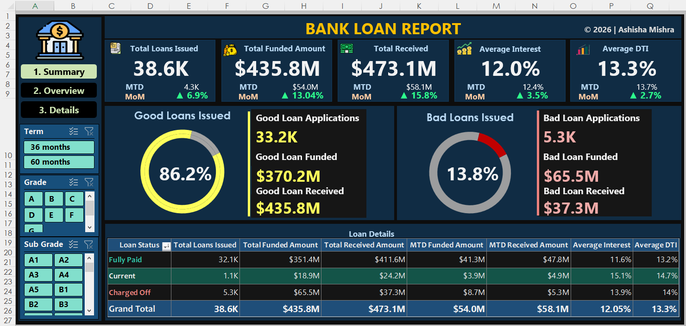
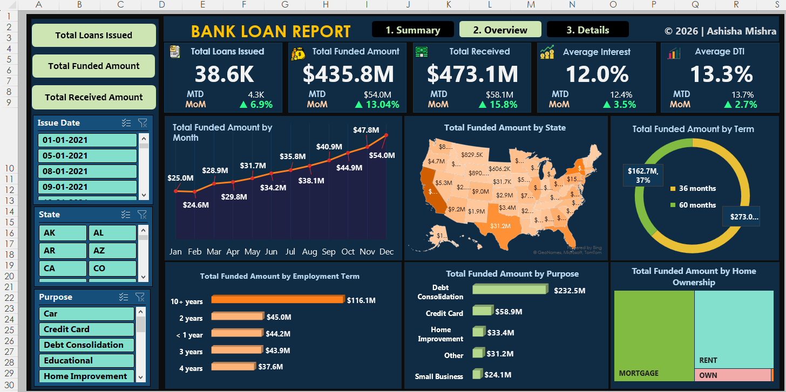
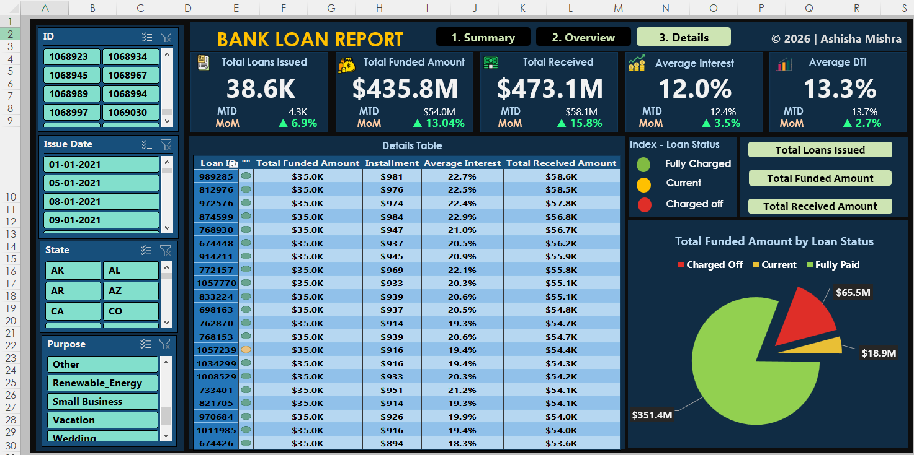
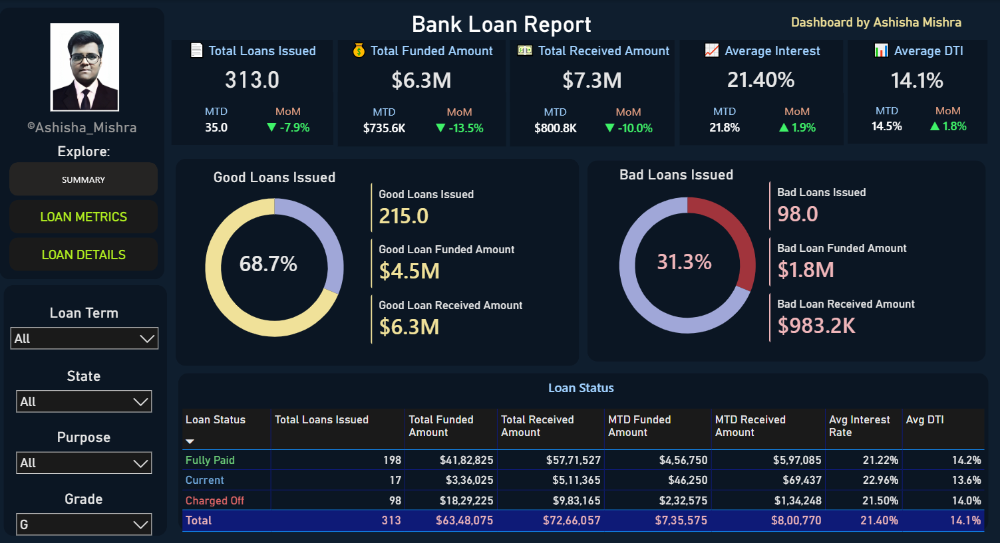
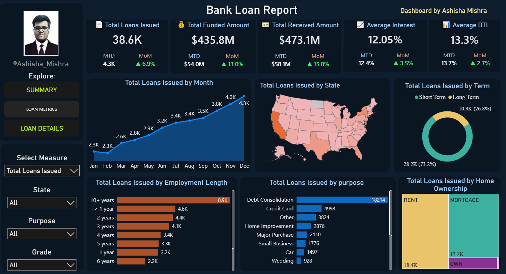
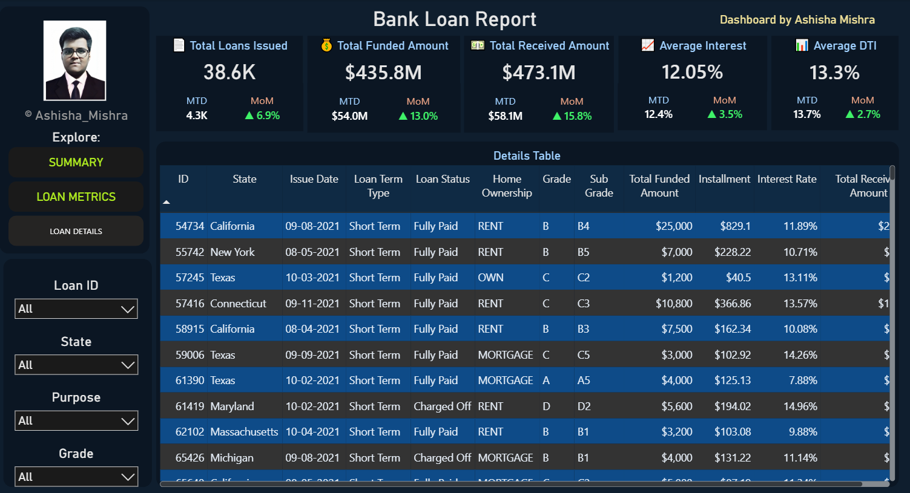

# 🏦 Bank Loan Analysis | End-to-End Data Analytics Project

An end-to-end Bank Loan Analysis project built using Python, Microsoft Excel, Power BI, and Tableau Public. The objective of this project is to analyze loan performance, borrower behaviour, repayment trends, and portfolio risk through interactive dashboards and business intelligence reporting.

The project follows the complete data analytics lifecycle—from data cleaning and exploratory analysis in Python to dashboard development in Excel and replication in Power BI and Tableau—providing actionable business insights through interactive visualizations.

## 🛠️ Tools Used

🐍 Python:	Data Cleaning, Exploratory Data Analysis (EDA), KPI Calculation, Business Insight Generation, 

📗 Microsoft Excel: Pivot Tables, Pivot Charts, Slicers, Timeline Filters, Conditional Formatting, Interactive Dashboard

📊 Power BI: Power Query, Data Modeling, Relationships, DAX Measures, Calculated Columns, Parameters, Interactive Dashboards

📈 Tableau: Public	Calculated Fields, Parameters, Dashboard Actions, Interactive Filters, Highlight Actions, Maps

## 🐍 Python Analysis

Python was used for data cleaning, preprocessing, exploratory data analysis (EDA), KPI calculations, trend analysis, and business insight generation. Using Pandas, NumPy, and Matplotlib, the project transformed raw loan data into meaningful business insights, validated dashboard KPIs, and generated supporting visualizations used throughout the analysis.

Libraries Used:

1. **Pandas**: Data Manipulation & Analysis

2. **NumPy**:	Numerical Computation

3. **Matplotlib**:	Data Visualization

## 📗 Excel Dashboard

The original dashboard was built in Microsoft Excel using Pivot Tables, Pivot Charts, Slicers, Timeline Filters, Conditional Formatting, and interactive dashboard design techniques. Users can dynamically switch between Total Loans Issued, Total Funded Amount, and Total Amount Received, with every KPI card, chart, and visualization updating automatically based on the selected metric. Interactive slicers enable analysis by Issue Date, State, Purpose, Loan Term, Grade, and Sub Grade, allowing users to explore the loan portfolio from multiple business perspectives.

📎 Workbook: [Excel_Workbook](E2E_PROJECT_3_BL.xlsm)

(The Excel workbook is included in this repository. Download it to interact with all filters, slicers, and dashboard elements.)

## 📊 Power BI Dashboard

The dashboard was recreated in Power BI using Power Query for data cleaning and transformation, data modeling, relationships, DAX measures, calculated columns, and dynamic parameters. Interactive slicers, KPI cards, and cross-filtering provide a seamless analytical experience. A dynamic parameter allows users to switch between Total Loans Issued, Total Funded Amount, and Total Amount Received, automatically updating every visual across the report while preserving the same business logic as the Excel dashboard.

### 🔗 Power BI Dashboard Link

[View Live Dashboard](https://app.powerbi.com/view?r=eyJrIjoiNGM5ZmZmMzQtOTQyNy00MDY0LThjZGYtMjFhMzNjZTAyODgxIiwidCI6ImYxNWQ4YWQ1LTViZjYtNDg1NC1iNGRkLTg1MDM1MGNiYjhlMCJ9&embedImagePlaceholder=true&pageName=f6d61709b5e96242c90c)

## 📈 Tableau Public Dashboard

The Tableau dashboard was developed using Calculated Fields, Parameters, Interactive Filters, Dashboard Actions, Filter Actions, Highlight Actions, and Maps to recreate the same interactive experience. Users can dynamically switch between Total Loans Issued, Total Funded Amount, and Total Amount Received, with every chart and KPI updating instantly. Interactive filters allow users to explore lending performance across states, loan purposes, employment lengths, grades, and loan terms.

### 🔗 Tableau Public Dashboard Link
[View Live Dashboard](https://public.tableau.com/views/E2EPROJECT3-BANKLOAN/DETAILS?:language=en-US&:sid=&:redirect=auth&:display_count=n&:origin=viz_share_link)

## 📊 Key Performance Indicators

**38.6K** *Total Loan Applications*

**$435.8M** *Total Funded Amount*

**$473.1M** *Total Amount Received*

**12.0%** *Average Interest Rate*

**13.3%** *Average Debt-to-Income Ratio*

**86.2%** *Good Loans*

**13.8%** *Bad Loans*

## 💡 Key Business Insights

- More than 38,000 loan applications were analyzed to evaluate the bank's lending portfolio.

- 86.2% of all loans were classified as good loans, indicating strong portfolio quality.

- Charged-off loans accounted for 13.8% of applications but represented a significant financial risk.

- The bank funded approximately $435.8 million while recovering $473.1 million, demonstrating healthy overall repayment performance.

- Debt Consolidation was the leading loan purpose by funded amount.

- Borrowers with 10+ years of employment received the highest total funding.

- Loan funding increased steadily throughout the year, indicating consistent lending growth.

## 📄 License

This project is licensed under the MIT License.

## 👤 Author

Ashisha Mishra

LinkedIn:

